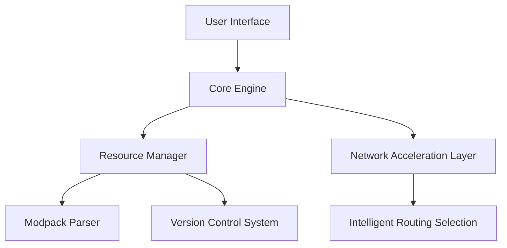

[日本語](/docs/ja.md) | [中文](/docs/cn.md) | [ئۇيغۇرچە](/docs/ug.md) |  [English](/README.md)
# ArkLauncher  
  

## Simple, Fast, Powerful.  

ArkLauncher redefines your Minecraft experience. Faster loading, smarter modpack management, and smoother network acceleration.  

---  

## 🚧 Still in Development – Stay Tuned!  
**ArkLauncher** is meticulously crafted, but core features are not yet fully open. We strive to deliver the smoothest experience—stay tuned for the official release!  

## Current Development Screenshots  
  

```bash
# Clone this project
git clone https://github.com/the-OmegaLabs/ArkLauncher.git

# Install dependencies
pip install -r requirements.txt

# Run!
python ark.py
```

---  

## ✨ A New Way to Play.  
- **Instant Launch** – Auto-login, lightning-fast game startup, no extra configuration needed.  
- **Modpack Management** – One-click install & update for CurseForge and Modrinth modpacks.  
- **Smart Acceleration** – Automatically selects the best CDN or proxy for ultra-fast downloads.  

## 💖 Designed Just for You.  
- **Immersive UI** – Dark mode, light mode, auto themes provide a stunning visual experience.  
- **Multilingual Support** – Enjoy Minecraft in your preferred language, no matter where you are.  

## 🔒 Secure and Trustworthy.  
- **Encrypted Account Storage** – Your data, accessible only by you.  
- **Built-in Mod Antivirus** – Ensures a safe gaming environment.  
- **Smart Crash Diagnostics** – Quickly identifies issues for a stable gaming experience.  

---  

## 🤝 Help Shape the Future of ArkLauncher  
Every contribution makes ArkLauncher even better. Join us in these areas:  
- **Modpack Expansion** – Improve compatibility with CurseForge/Modrinth modpacks for an effortless modded experience.  
- **Localization Support** – Break language barriers and make ArkLauncher accessible worldwide.  
- **Network Acceleration Enhancements** – Optimize routing algorithms for faster downloads and seamless mod loading.  
- **Cross-Platform Optimization** – Ensure smooth performance on various operating systems.  

🔗 [Submit Issues or PRs](https://github.com/the-OmegaLabs/ArkLauncher/issues) to join our developer community and contribute to ArkLauncher's evolution.  

### System Requirements  
- Python 3.13+  
- Windows 10/11, *nix, or Apple macOS (experimental support).  
---  

## 🧠 Technical Architecture  



## Contact Us 📮  
- GitHub Issues: https://github.com/the-OmegaLabs/ArkLauncher/issues  

---  

## 📜 License  
This project is open-source under the [Apache License 2.0](https://www.apache.org/licenses/LICENSE-2.0.html).  

© 2025 Omega Labs, ArkLauncher Contributors.  

## 🧡 Special Thanks  
  
<a href="https://github.com/the-OmegaLabs/Genryu-Gothic-PCJK">Genryu Gothic</a>

**A heartfelt thanks to these open-source projects for their contributions.**  

## ⚠️ Disclaimer  
*ArkLauncher is an **unofficial** Minecraft launcher and is in no way affiliated with Mojang Studios, Microsoft, or their official partners in China. It **does not support** the Chinese version of Minecraft operated by Mojang Studios' local partner in mainland China and provides **no related functionality** for it.*
