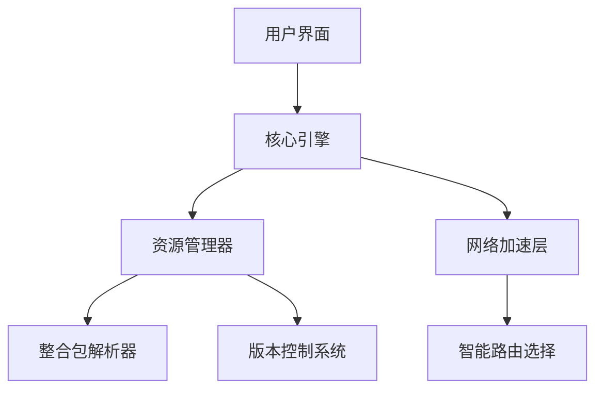

 <h1><b>ArkLauncher</b></h1>
 
<br>
<h2>简单，快速，强大。</h2>

ArkLauncher 重新定义了 Minecraft 启动方式。更快的加载速度，更智能的整合包管理，和更流畅的网络加速。无需等待，随时畅玩。

---
## 🚧 仍在打磨，敬请期待。
**ArkLauncher** 正在精心打造中，核心功能尚未完全开放。我们希望带来最流畅的体验，敬请期待正式发布！

---

## ✨ 开启全新游戏方式。 
- **即刻启动** - 自动登录，秒速进入游戏，无需额外配置。
- **整合管理** - 一键安装、更新 CurseForge 和 Modrinth 整合包，轻松探索更多可能。
- **智能加速** - 自动选择最佳 CDN 或反代节点，让下载快如闪电。

## 💖 专为你设计。 
- **沉浸式界面** - 深色、浅色、自动主题，配合动态模糊背景，视觉更惊艳。
- **多语言支持** - 无论你身处何地，都能用熟悉的语言畅享游戏。
- **系统级集成** - 后台服务模式、托盘快捷操作、全局快捷键，让启动游戏更简单

## 🔒 安全，值得信赖。 
- **账户加密存储**，你的数据，只有你能访问。
- **内置 Mod 杀毒引擎**，确保游戏环境安全无忧。
- **智能崩溃诊断**，助你快速找到问题，让游戏稳定运行。

## 安装指南 🛠️
### 环境要求
- Python 3.11.2+
- Windows 10/11 或 Linux（实验性支持）

```bash
# 克隆仓库
git clone https://github.com/the-OmegaLabs/ArkLauncher.git

# 安装依赖
pip install -r requirements.txt

# 运行！
python ark.py
```

## 🤝 一起打造更好的 ArkLauncher
你的每一份贡献，都将让 ArkLauncher 更强大。

📌 你可以参与：

- 整合包支持：适配更多 CurseForge/Modrinth 整合包，让启动更简单。
- 多语言翻译：帮助全球玩家无障碍使用 ArkLauncher。
- 网络加速优化：提升下载速度，让资源加载更快。
- Linux 兼容性优化：让更多系统流畅运行 ArkLauncher。

🔗[提交 Issue 或 PR](https://github.com/the-OmegaLabs/ArkLauncher/issues)  


## 🧠 技术架构
ArkLauncher 由多个模块协同工作，确保启动流畅无阻：


## 📜 开源许可证
本项目基于 [Apache License 2.0](https://www.apache.org/licenses/LICENSE-2.0.html) 开源

Copyright 2025 Omega Labs, ArkLauncher Contributors.

## 📮 联系我们 
遇到问题或有更好的想法？
- GitHub Issues: https://github.com/the-OmegaLabs/ArkLauncher/issues
---

🚀 **让 Minecraft 启动体验进入次世代！**  
[立即下载最新版本](https://github.com/the-OmegaLabs/ArkLauncher/releases)  

## 现开发版本截图


## ⚠️ 重要声明
¹：**ArkLauncher 是 Minecraft 的非官方启动器，未与 Mojang Studios、Microsoft 或其中国代理有*任何*从属或关联。**

²：**ArkLauncher 不支持 Mojang Studios 在中国大陆代理运营的 Minecraft 版本，并*不会*提供相关功能支持。***