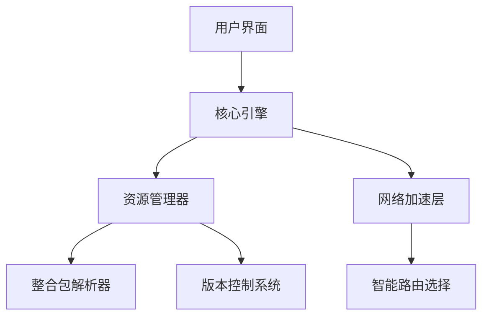

# ArkLauncher - 为快速启动而生


## 项目简介
ArkLauncher是一款为Minecraft玩家设计的现代化启动器，专注于提供快速游戏启动、便捷整合包管理和智能网络加速功能。由Omega Labs团队开发，采用Apache License 2.0开源协议，支持Windows系统（Linux支持开发中）。

# ⚠️该项目开发中，核心功能不可用，不建议现在投入正式使用

## 主要特性 ✨
- **极速启动** - 基于cmcl的极速启动，无任何负担
- **整合包管理** - 一键下载/更新主流整合包（CurseForge/Modrinth Pack等）
- **智能加速** - 自动选择最优CDN或反代节点加速下载
- **个性化界面**：
  - 深色/浅色/自动主题模式
  - 多语言支持（中文/英文/日文等）
  - 动态模糊背景与交互动画
- **系统集成**：
  - 后台服务模式
  - 系统托盘快捷操作
  - 全局快捷键支持
- **安全可靠**：
  - 加密存储账户cookie
  - 集成mod杀毒引擎
  - 异常崩溃诊断

## 安装指南 🛠️
### 环境要求
- Python 3.11.2+
- Windows 10/11 或 Linux（实验性支持）

```bash
# 克隆仓库
git clone https://github.com/the-OmegaLabs/ArkLauncher.git

# 安装依赖
pip install -r requirements.txt

# 首次运行
python ark.py
```

## 使用说明 🎮
1. **主界面**：
   - 左上角LOGO：杀死当前页面（类似于BakaXL逻辑）
   - 顶部搜索栏：快速查找安装的整合包
   - 右下角控制面板：游戏启动/设置入口

2. **核心功能**：
   - 整合包分析：主流格式一键解析并补全依赖
   - 实例管理：支持版本隔离、多包管理、一键打包
   - 资源加速：内置反代信息源，自动通过公开代理或反代加速下载


## 贡献指南 🤝
欢迎通过以下方式参与贡献：
1. 提交整合包适配方案
2. 翻译多语言资源
3. 完成网络加速模块
4. 完善Linux系统支持


## 技术架构 🧠


## 许可证 📜
本项目基于 [Apache License 2.0](https://www.apache.org/licenses/LICENSE-2.0.html) 开源

Copyright 2025 Omega Labs, ArkLauncher Contributors.

## 联系我们 📮
- GitHub Issues: https://github.com/the-OmegaLabs/ArkLauncher/issues
- 开发团队QQ: 1605183891(Stevesuk) 2860483411(bzym2)

---

**让Minecraft启动体验进入次世代！** 🚀  
[立即下载最新版本](https://github.com/the-OmegaLabs/ArkLauncher/releases)  

