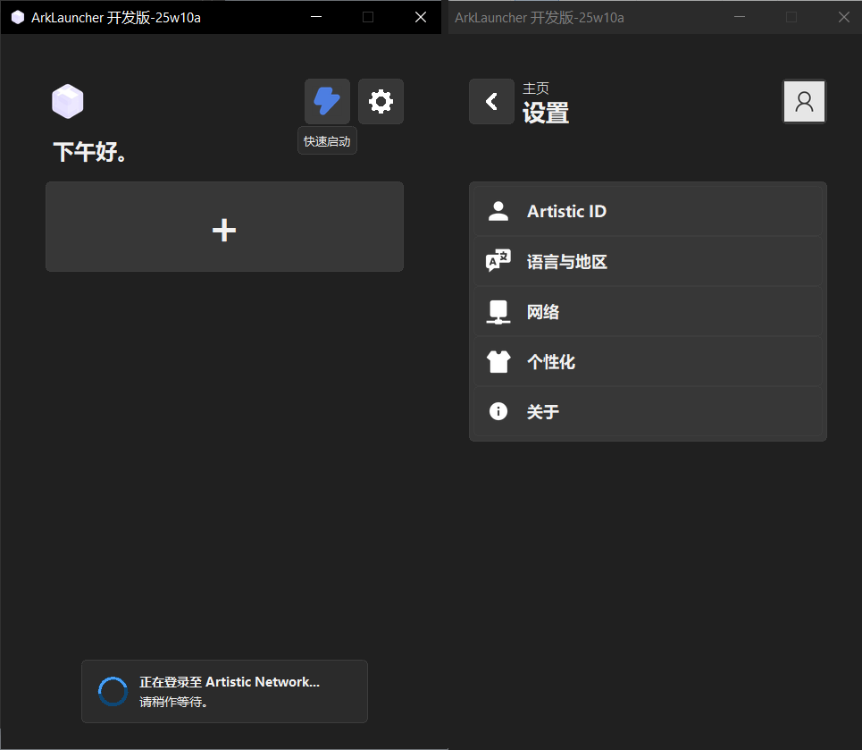
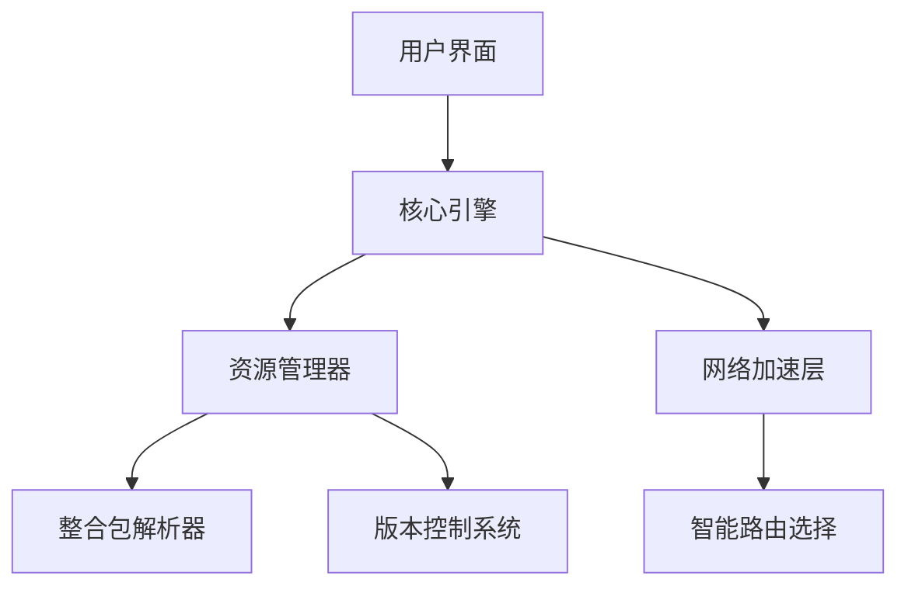

[日本語](docu/ja.md)
# ArkLauncher

<br>
<h2>简单，快速，强大。</h2>

ArkLauncher 重塑了你的 Minecraft 体验。更快的加载速度，更智能的整合包管理，和更流畅的网络加速。

---

## 🚧 仍在打磨，敬请期待。
**ArkLauncher** 正在精心打造中，核心功能尚未完全开放。我们希望带来最流畅的体验，敬请期待正式发布！

## 现开发版本截图


---

## ✨ 开启全新游戏方式。 
- **即刻启动** - 自动登录，秒速进入游戏，无需额外配置。
- **整合管理** - 一键安装、更新 CurseForge 和 Modrinth 整合包，轻松探索更多可能。
- **智能加速** - 自动选择最佳 CDN 或反代节点，让下载快如闪电。

## 💖 专为你设计。 
- **沉浸式界面** - 深色、浅色、自动主题，配合动态模糊背景，视觉更惊艳。
- **多语言支持** - 无论你身处何地，都能用熟悉的语言畅享游戏。
- **系统级集成** - 后台服务模式、托盘快捷操作、全局快捷键，让启动游戏更简单

## 🔒 安全，值得信赖。 
- **账户加密存储**，你的数据，只有你能访问。
- **内置 Mod 杀毒引擎**，确保游戏环境安全无忧。
- **智能崩溃诊断**，助你快速找到问题，让游戏稳定运行。

---

## 🤝 一起塑造 ArkLauncher 的未来
你的每一份贡献，都将让 ArkLauncher 更加强大。以下是你可以参与的领域：
- **整合包拓展**：适配更多 CurseForge/Modrinth 整合包，让启动器兼容性更上一层楼，玩家无需复杂配置，即可畅享丰富模组体验。
- **多语言支持**：帮助全球玩家无障碍使用 ArkLauncher，打破语言壁垒，让游戏乐趣遍布世界每个角落。
- **网络加速升级**：优化智能路由选择算法，提升下载速度，确保资源高速加载，为玩家带来更流畅的游戏准备体验。
- **跨平台体验优化**：完善对不同操作系统的适配，让更多设备能够流畅运行 ArkLauncher，无论你使用何种系统，都能享受一致的优质服务。


🔗 [点击提交 Issue 或 PR](https://github.com/the-OmegaLabs/ArkLauncher/issues)，加入我们的开发社区，与众多开发者一起，为 ArkLauncher 的持续进化贡献力量。

### 环境要求
- Python 3.13+
- Windows 10/11，*nix 或 Apple macOS（实验性支持）。

```bash
# 克隆该项目
git clone https://github.com/the-OmegaLabs/ArkLauncher.git

# 安装依赖
pip install -r requirements.txt

# 运行！
python ark.py
```

🔗[提交 Issue 或 PR](https://github.com/the-OmegaLabs/ArkLauncher/issues)

---

## 🧠 技术架构 

## 联系我们 📮
- GitHub Issues: https://github.com/the-OmegaLabs/ArkLauncher/issues
---
## 📜 许可证
本项目基于 [Apache License 2.0](https://www.apache.org/licenses/LICENSE-2.0.html) 开源。

Copyright 2025 Omega Labs, ArkLauncher Contributors.

## 🧡 特别鸣谢


**致谢以上开源项目，携手共铸卓越。**

## ⚠️ 免责声明
*ArkLauncher 是一个**非官方**的 Minecraft 启动器，与 Mojang Studios、Microsoft 或他们位于中国大陆的代理公司之间**并无任何从属或关联**，并且**不支持** Minecraft 游戏开发商 Mojang Studios 在中国大陆代理公司运营的国内代理版本，也**不为**该版本提供任何相关功能。*