# ArkLauncher 


## 项目简介
ArkLauncher 是一款为 Minecraft¹ 玩家设计的现代化的、跨平台启动器。专注于提供快速游戏启动、便捷整合包管理和智能网络加速功能。

# ⚠️该项目开发中，核心功能不可用，不建议现在投入正式使用

## 主要特性 ✨
- **极速启动** - 自动登录，极速启动，无任何负担
- **整合包管理** - 一键下载/更新主流整合包（CurseForge/Modrinth Pack等）
- **智能加速** - 自动选择最优CDN或反代节点加速下载
- **个性化界面**：
  - 深色/浅色/自动主题模式
  - 多语言支持
  - 动态模糊背景与交互动画
- **系统集成**：
  - 后台服务模式
  - 系统托盘快捷操作
  - 全局快捷键支持
- **安全可靠**：
  - 加密存储账户 cookie
  - 集成 mod 杀毒引擎
  - 异常崩溃诊断

## 安装指南 🛠️
### 环境要求
- Python 3.11.2+
- Windows 10/11 或 Linux（实验性支持）

```bash
# 克隆仓库
git clone https://github.com/the-OmegaLabs/ArkLauncher.git

# 安装依赖
pip install -r requirements.txt

# 首次运行
python ark.py
```

**核心功能**：
   - 整合包分析：主流格式一键解析并补全依赖
   - 实例管理：支持版本隔离、多包管理、一键打包
   - 资源加速：内置反代信息源，自动通过公开代理或反代加速下载


## 🤝 贡献指南 
欢迎通过以下方式参与贡献：
1. 提交整合包适配方案
2. 翻译多语言资源
3. 完成网络加速模块
4. 完善 Linux 系统支持


## 技术架构 🧠

```mermaid
graph TD
    A[用户界面] --> B[核心引擎]
    B --> C[资源管理器]
    B --> D[网络加速层]
    C --> E[整合包解析器]
    D --> F[智能路由选择]
    C --> G[版本控制系统]
```


## 许可证 📜
本项目基于 [Apache License 2.0](https://www.apache.org/licenses/LICENSE-2.0.html) 开源

Copyright 2025 Omega Labs, ArkLauncher Contributors.

## 联系我们 📮
- GitHub Issues: https://github.com/the-OmegaLabs/ArkLauncher/issues
---

🚀 **让 Minecraft 启动体验进入次世代！**  
[立即下载最新版本](https://github.com/the-OmegaLabs/ArkLauncher/releases)  

## 现开发版本截图


## 注：
¹：**ArkLauncher 是一个非官方的 Minecraft 启动器，与 Mojang Studios、Microsoft 或他们位于中国大陆的代理公司之间*并无任何从属或关联*。**

²：**ArkLauncher 不支持 Minecraft 游戏开发商 Mojang Studios 在中国大陆代理公司运营的国内代理版本，且*不为该版本提供任何相关功能。***