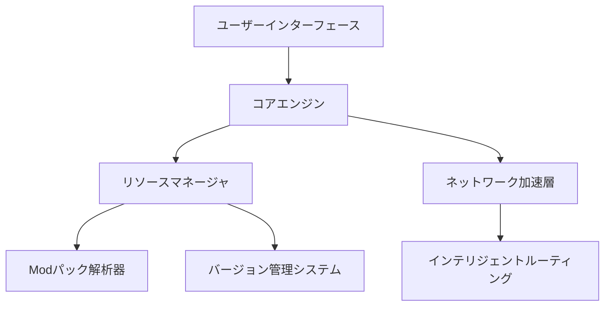

# ArkLauncher

 
<h2>シンプル、高速、パワフル。</h2>

ArkLauncherはMinecraftの起動方法を再定義します。高速なロード、スマートなModパック管理、滑らかなネットワーク加速。待ち時間なしでいつでもプレイ可能。

---
## 🚧 鋭意開発中
**ArkLauncher**は現在開発真っ最中です。コア機能はまだ公開されておりません。最良の体験を提供するため、正式リリースをお待ちください！

---

## ✨ 新しいゲーム体験を開始 
- **即時起動** - 自動ログインで設定不要、瞬時にゲーム開始
- **統合管理** - CurseForge/ModrinthのModパックをワンクリックでインストール&更新
- **インテリジェント加速** - 最適なCDN/プロキシを自動選択、超高速ダウンロード

## 💖 ユーザーのために設計 
- **没入型UI** - ダーク/ライトテーマ、動的ぼかし背景で視覚的に魅力的
- **多言語対応** - 母国語で快適に操作可能
- **システム統合** - バックグラウンドサービス、トレイ操作、グローバルショートカットで簡単アクセス

## 🔒 安全で信頼可能 
- **アカウント暗号化保存** - あなたのデータは厳重に保護
- **組み込みModウイルススキャン** - 安全なゲーム環境を保証
- **スマートクラッシュ診断** - 問題を素早く特定し安定稼働をサポート

## インストールガイド 🛠️
### 動作環境
- Python 3.11.2+
- Windows 10/11 または Linux（実験的サポート）

# 依存関係インストール
pip install -r requirements.txt

# 初回起動
python ark.py

## スペシャルサンクス 🧡
- ### [🎨 maliang Tkinter改版](https://github.com/Xiaokang2022/maliang)
- ### [🗛 源流ゴシック フォント](https://github.com/the-OmegaLabs/Genryu-Gothic-PCJK)
- ### [🧊 Artistic Network](https://playat.cn/)
- ### [🔧 Modrinth Modパックサービス](https://modrinth.com)
- ### [⚙️ Curseforge Modパックサービス](https://curseforge.com)

## 🤝 共にArkLauncherを育てよう
皆様の貢献がArkLauncherをさらに強力にします。

📌 参加方法：
- Modパック対応: 各種Modパックのサポート強化
- 翻訳協力: 多言語化で全世界のプレイヤーに
- ネットワーク最適化: ダウンロード速度向上
- Linux互換性改善: マルチOS対応推進

🔗[Issue/PRの提出](https://github.com/the-OmegaLabs/ArkLauncher/issues)

## 技術アーキテクチャ 🧠

## ライセンス 📜
本プロジェクトは[Apache License 2.0](https://www.apache.org/licenses/LICENSE-2.0.html)で公開されています

Copyright 2025 Omega Labs, ArkLauncher Contributors.

## お問い合わせ 📮
- GitHub Issues: https://github.com/the-OmegaLabs/ArkLauncher/issues

---
## 開発版スクリーンショット

