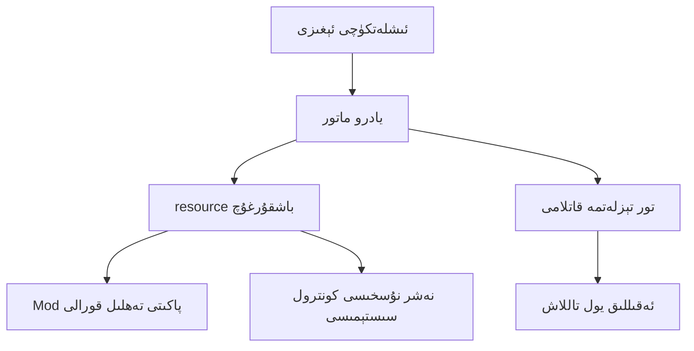

# ArkLauncher

 
<h2>ئاددىي، تېز، كۈچلۈك.</h2>

ArkLauncher Minecraft نى قوزغىتىش usulini يېڭىلايدۇ. تېز يۈكلەش، ئەقىللىق Mod پاكىتى باشقۇرۇش ۋە يۇمشاق تور تېزلەتمىسى. ساقلاش ۋاقتىسىز، ھەر ۋاقىت ئويناش مۇمكىن.

---
## 🚧 تەرەققىيات دەۋرىدە
**ArkLauncher** ھازىر ئىجاد قىلىنىۋاتىدۇ، ئاساسلىق ئىقتىدارلار تاماشىبىنچىلارغا ئېچىلمىدى. ئەڭ ياخشى تەجرىبىنى تەمىنلەش ئۈچۈن، رەسمىي نەشىرنى ساقلاڭ!

---

## ✨ يېڭى ئويناش usulini باشلاڭ 
- **دەرھال قوزغات** - ئاپتوماتىك كىرىش، قوشۇمچە سەپلىمىسىز، ۋاقتىدا ئويناش
- **بىرلىك باشقۇرۇش** - CurseForge/Modrinth Mod پاكىتىنى بىر چېكىش بىلەن ئورنىتىش ۋە يېڭىلاش
- **ئەقىللىق تېزلەتمە** - ئەڭ ياخشى CDN/پروكسىنى ئاپتوماتىك تاللاش، ئىنتايىن تېز چۈشۈرۈش

## 💖 سىز ئۈچۈن لايىھىلەنگەن 
- **چۆمكىن ئىنتېرفېيس** - قاراڭغۇ/ئېچىق تېما، ھەرىكەتلىك بۇلۇت فونى بىلەن كۆرۈنەرلىك
- **كۆپ تىل قوللىشىش** - ئۆز تىلىڭىزدا ئوڭۇشلۇق ئىشلىتىش
- **سىستېما سەۋىيىلىك ئۇيغۇنلاشتۇرۇش** - ئارقا سېلىشتا مۇلازىمەت، تىزىملىك تېز يول، ئومۇمىي تېز كۇنۇپكا بىلەن قولاي قوزغات

## 🔒 بىخەتەر، ئىشەنچلىك 
- **ھېساباتنى شىفىرلاش** - سىزنىڭ سانلىق مەلۇماتىڭىز قاتتىق قوغدىلىدۇ
- **ئىچكى Mod ۋىرۇس تەكشۈرگۈچ** - بىخەتەر ئويناش مۇھىتى
- **ئەقىللىق بۇزۇلۇش دىئاگنوزى** - مەسىلىلەرنى تېز بايقاش ۋە تىنچ ئىشلەش

## ئورنىتىش يېتەكچىسى 🛠️
### تەلەپ قىلىنىدىغان مۇھىت
- Python 3.11.2+
- Windows 10/11 ياكى Linux (تەجرىبىلىك قوللىش)

# مۇھتاجلىقلارنى ئورنىتىش
pip install -r requirements.txt

# تۇنجى قېتىم قوزغاتش
python ark.py

## رەھمەت 🧡
- ### [🎨 maliang Tkinter نەشرى](https://github.com/Xiaokang2022/maliang)
- ### [🗛 Genryu Gothic خەت نۇسخىسى](https://github.com/the-OmegaLabs/Genryu-Gothic-PCJK)
- ### [🧊 Artistic Network](https://playat.cn/)
- ### [🔧 Modrinth Mod پاكىتى مۇلازىمىتى](https://modrinth.com)
- ### [⚙️ Curseforge Mod پاكىتى مۇلازىمىتى](https://curseforge.com)

## 🤝 بىرلىكتە ياخشىراق ArkLauncher قۇرايلى
ھەر قانداق تۆھپىڭىز ArkLauncher نى تېخىمۇ كۈچلۈك قىلىدۇ.

📌 قاتنىشالايدىغان يۆنىلىشلەر:
- Mod پاكىتى قوللىش: تورلۇق Mod پاكىتلىرىنى قوللاش
- تىل تەرجىمىسى: دۇنياۋى ئىشلەتكۈچىلەرگە ياردەم
- تور تېزلەتمىسىنى ياخشىلاش: چۈشۈرۈش سۈرئىتىنى ئاشۇرۇش
- Linux ماسلىشىشى: كۆپ سىستېما قوللىشىش

🔗[Issue ياكى PR يوللاش](https://github.com/the-OmegaLabs/ArkLauncher/issues)

## تېخنىكا ئارخىتېكتۇراسى 🧠

## لىسېنسیا 📜
بۇ تۈر [Apache License 2.0](https://www.apache.org/licenses/LICENSE-2.0.html) ئاستىدا ئوچۇق كودلۇق

Copyright 2025 Omega Labs, ArkLauncher Contributors.

## ئالاقىلىشىش 📮
- GitHub Issues: https://github.com/the-OmegaLabs/ArkLauncher/issues

---
## يېتەكچى نەشرىدىن ئېكران كۆرۈنۈشى

